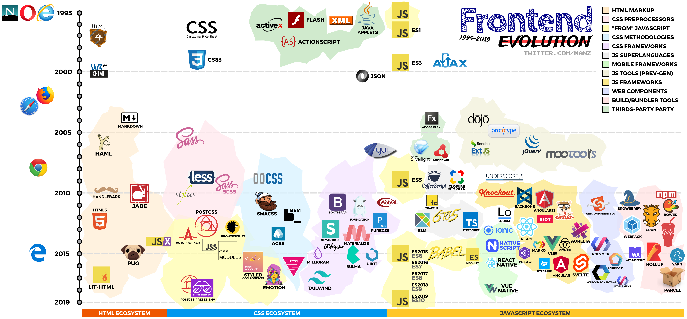

# 

### 🌐 Browsers

- [1995] Internet Explorer <https://www.microsoft.com/es-es/download/internet-explorer.aspx>
- [1995] Opera <https://www.opera.com/es>
- [2002] Mozilla Firefox <https://www.mozilla.org/en-US/firefox/new/>
- [2003] Apple Safari <https://www.apple.com/safari/>
- [2008] Google Chrome <https://www.google.com/chrome/>
- [2015] Microsoft Edge <https://www.microsoft.com/en-us/windows/microsoft-edge>

## 🏷️ HTML Ecosystem

### HTML Markup

- [1997] HTML4 <https://www.w3.org/TR/html401/>
- [2000] XHTML <https://www.w3.org/TR/xhtml1/>
- [2004] Markdown <https://daringfireball.net/projects/markdown/>
- [2006] HAML <http://haml.info/>
- [2010] Handlebars <https://handlebarsjs.com/>
- [2010] JADE <https://pugjs.org/>
- [2012] HTML5 (*Candidate Recommendation*) <https://www.w3.org/TR/html5/>
- [2014] JSX <https://facebook.github.io/jsx/>
- [2015] PugJS (*Previous JADE*) <https://pugjs.org/>
- [2017] Lit-HTML <https://lit-html.polymer-project.org/>

## 🎨 CSS Ecosystem

### CSS Language & Interaction

- [1996] CSS1 <https://www.w3.org/TR/REC-CSS1/>
- [1999] CSS3 <https://www.w3.org/TR/CSS/>
- [1996] Flash <https://www.adobe.com/es/products/flashplayer.html>
- [1997] ActionScript <https://www.adobe.com/devnet/actionscript.html>

### CSS Preprocessors

- [2006] Sass <https://sass-lang.com/>
- [2009] LESS <http://lesscss.org/>
- [2010] Sass (SCSS) <https://sass-lang.com/>
- [2010] Stylus <http://stylus-lang.com/>

### JS Tools & CSS-in-JS

- [2013] PostCSS <https://postcss.org/>
- [2014] Autoprefixer <https://autoprefixer.github.io/>
- [2014] Browserslist <https://browserl.ist/>
- [2014] JSS <https://cssinjs.org/>
- [2015] CSS Modules <https://github.com/css-modules/css-modules>
- [2016] Styled Components <https://www.styled-components.com/>
- [2017] Emotion <https://emotion.sh/>

### CSS Methodologies

- [2009] OOCSS <http://oocss.org/>
- [2011] SMACSS <http://smacss.com/>
- [2012] BEM <http://getbem.com/>
- [2013] ACSS <https://acss.io/>
- [2016] ITCSS <https://itcss.io/>

### CSS Frameworks

- [2006] YUI <https://yui.github.io/yui2/>
- [2011] Twitter Bootstrap <https://getbootstrap.com/>
- [2011] Foundation <https://foundation.zurb.com/>
- [2012] Pure CSS <https://purecss.io/>
- [2013] Semantic UI <https://semantic-ui.com/>
- [2013] Materialize CSS <https://materializecss.com/>
- [2015] Milligram <https://milligram.io/>
- [2015] Bulma <https://bulma.io/>
- [2015] UIKit <https://getuikit.com/>
- [2017] Tailwind CSS <https://tailwindcss.com/>

## 💻 Javascript Ecosystem

### Javascript vanilla

- [1995] Javascript [ES1 Edition](https://www.ecma-international.org/publications/files/ECMA-ST-ARCH/ECMA-262,%201st%20edition,%20June%201997.pdf)
- [2009] Javascript [ES5 Edition](https://www.ecma-international.org/publications/files/ECMA-ST-ARCH/ECMA-262%205th%20edition%20December%202009.pdf)
- [2015] Javascript [ES6 Edition](https://www.ecma-international.org/ecma-262/6.0/index.html)
- [2016] Javascript [ES7 Edition](https://www.ecma-international.org/ecma-262/7.0/index.html)
- [2015] Javascript [ES8 Edition](https://www.ecma-international.org/ecma-262/8.0/index.html)
- [2016] Javascript [ES9 Edition](https://www.ecma-international.org/ecma-262/9.0/index.html)
- [2017] Javascript [ES10 Edition](https://www.ecma-international.org/publications/standards/Ecma-262.htm)

### JS libraries

- [2004] Dojo toolkit <https://dojotoolkit.org/>
- [2005] Prototype <http://prototypejs.org/>
- [2006] jQuery <https://jquery.com/>
- [2006] ExtJS <https://www.sencha.com/products/extjs/>
- [2007] MooTools <https://mootools.net/>
- [2009] Underscore <https://underscorejs.org/>
- [2012] Lodash <https://lodash.com/>

### JS superlanguage & transpilers

- [2009] CoffeeScript <https://coffeescript.org/>
- [2012] Elm <https://elm-lang.org/>
- [2012] 6to5 transpiler <https://github.com/6to5>
- [2012] Typescript <https://www.typescriptlang.org/>
- [2015] BabelJS (*previous 6to5*) <https://babeljs.io/>

### JS Frameworks

- [2010] Knockout <https://knockoutjs.com/>
- [2010] Backbone <https://backbonejs.org/>
- [2010] AngularJS <https://angularjs.org/>
- [2011] EmberJS <https://emberjs.com/>
- [2013] React <https://reactjs.org/>
- [2014] Aurelia <https://aurelia.io/>
- [2014] Marko <https://markojs.com/>
- [2015] Vue <https://vuejs.org/>
- [2015] Preact <https://preactjs.com/>
- [2016] HyperApp <https://github.com/JorgeBucaran/hyperapp>
- [2016] Angular <https://angular.io/>
- [2016] Svelte <https://svelte.dev/>

### Mobile JS Frameworks

- [2013] Ionic <https://ionicframework.com/>
- [2014] Native Script <https://www.nativescript.org/>
- [2015] React Native <https://facebook.github.io/react-native/>
- [2018] Vue Native <https://vue-native.io/>

### Web Components Ecosystem

- [2011] WebComponents v0
- [2014] Polymer <https://www.polymer-project.org/>
- [2016] HybridsJS <https://hybrids.js.org/>
- [2017] WebComponents v1 <https://www.webcomponents.org/>
- [2018] Lit-Element <https://lit-element.polymer-project.org/>

### Build/Bundler Tools

- [2010] NPM <https://www.npmjs.com/>
- [2010] Browserify <http://browserify.org/>
- [2012] Grunt <https://gruntjs.com/>
- [2013] Webpack <https://webpack.js.org/>
- [2014] Gulp <https://gulpjs.com/>
- [2015] Rollup <https://rollupjs.org/>
- [2017] Parcel <https://parceljs.org/>

## 👨‍💻 Author

- 🐦 <https://twitter.com/Manz>
- 🏷️ <https://lenguajehtml.com/>
- 🎨 <https://lenguajecss.com/>
- 💻 <https://lenguajejs.com/>
- 🖥️ <https://terminaldelinux.com/>
- ⚡ <https://manzdev.github.io/>